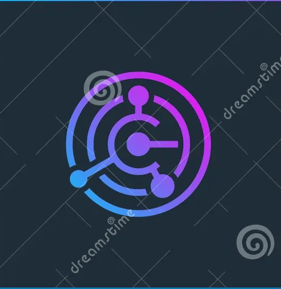

# ⚡ Cobalt Labs

> **Building fast, beautiful, and reliable systems with Flutter & Rust.**

After 7 years of grinding — from HTML/CSS to hating JavaScript, through Java, Python, Dart/Flutter + FFI, and finally discovering my true passion in Rust — I founded **Cobalt Labs**.

I build production-grade applications, high-performance backends, and personal infrastructure tools that I actually use myself.

---

## 🚀 What I've Built

### Cobalt Cloud
**Private self-hosted cloud storage** running on my own laptop HDD.  
Drag & drop files from a beautiful Dioxus client → saved securely on real hardware.  
Built with **Rust + Axum + object_store + Dioxus**.

### Secure Journal
A private, encrypted journaling app with **Rust backend (Axum + SQLx)** and clean Flutter/Dioxus frontend. Your thoughts stay yours.

### Flutter + Rust Hybrid Apps
Multiple production apps using **Flutter** for stunning UI and **Rust** for performance-critical core via FFI.

### Rust Backend Systems
Scalable microservices and APIs built with **Axum**, **SQLx**, and **Tokio**. Fast, memory-safe, and production ready.

### Algorithms & CLI Tools
Collection of Data Structures & Algorithms in Rust + various command-line tools for daily use.

---

## 👨‍💻 About Me

Hi, I'm **Ibrahim Haji** — Founder of **Cobalt Labs**.

I'm a **Flutter + Rust Developer** who loves building end-to-end systems. From pixel-perfect mobile apps to high-performance backends and private cloud infrastructure — I focus on performance, privacy, and ownership.

Currently deep into:
- Rust systems programming
- Private cloud & self-hosted infrastructure
- Flutter + Rust FFI bridges
- Future plans: modified Linux kernel in Rust, custom ROMs, and Bevy games

Check out my work: **[cobalt.vercel.app](https://cobalt.vercel.app)**

---

## 🛠 Tech Stack

- **Frontend**: Flutter, Dioxus
- **Backend**: Rust, Axum, SQLx, Tokio
- **Infrastructure**: object_store, private cloud on real hardware
- **Tools**: FFI, CLI, DSA in Rust

---

## 📦 Current Projects

- **Cobalt Cloud** — Private cloud (Desktop + Web)
- **Secure Journal** — Encrypted journaling app
- **Cobalt Frontend** — Flutter web portfolio (this site)
- **Rust Experiments** — Algorithms, CLI tools, and low-level systems

More coming soon.

---

## 🔮 Future Plans

- Multi-HDD cloud pooling
- S3-compatible API layer
- Flutter mobile client with Rust backend
- Bevy game engine projects
- Modified Linux kernel in Rust
- Custom ROM development

**Inshallah**, these become the foundation of something much bigger.

---

## ❤️ Built With Passion

Made in Pune, Maharashtra with pure Rust love and countless late nights.

If you're also obsessed with building real systems from scratch — feel free to reach out or star the repos.

**Ibrahim Haji**  
Founder, Cobalt Labs  
[cobalt.vercel.app](https://cobalt.vercel.app)  
GitHub: [@ibrahim-3595](https://github.com/ibrahim-3595)

---

**Made in Rust and Flutter• Powered by Grind • Running on Real Hardware**