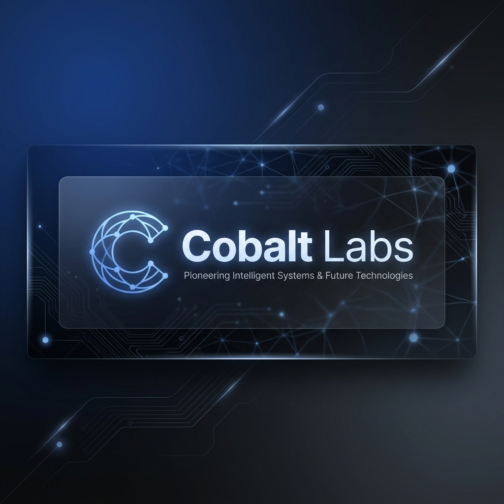

  
  
  # ⚡ Cobalt Labs
  
  ### **Pioneering Intelligent Systems & Future Technologies**
  
  
  
  
  

  ---

  *“Building fast, beautiful, and reliable systems with Flutter & Rust.”*
  
  [**Portfolio**](https://cobaltdev.vercel.app) • [**GitHub**](https://github.com/ibrahim-3595) • [**Contact**](mailto:ibrahimhaji@example.com)

---

## 🌌 The Ecosystem

Cobalt Labs is a specialized development house focused on the intersection of **low-level systems** and **high-level aesthetic interfaces**. We don't just build apps; we build the infrastructure they run on.

### 🛠 **[Cobalt Systems](file:///Users/ibrahimhaji/code/cobaltdev/cobalt_systems)**
The bedrock of our technology.
- **[Cobalt Kernel](file:///Users/ibrahimhaji/code/cobaltdev/cobalt_systems/kernel)**: A custom, monolithic-inspired kernel built from scratch in **Rust** (`no_std`). Featuring its own memory management, panic handlers, and a growing syscall interface.
- **Terminal CLI**: A robust, feature-rich shell interface designed for kernel-level interaction.

### ☁️ **[Cobalt Cloud](file:///Users/ibrahimhaji/code/cobaltdev/cobalt_cloud)**
Reclaiming digital sovereignty.
- **Private Storage**: Self-hosted cloud infrastructure running on bare-metal hardware.
- **Axum Backend**: High-concurrency file processing engine built with **Rust + Tokio**.
- **Dioxus Client**: A sleek, cross-platform desktop client with drag-and-drop capabilities.

### 🧠 **[Cobalt AI](file:///Users/ibrahimhaji/code/cobaltdev/cobalt_ai)**
Exploring the frontier.
- **Neural Experiments**: Implementing neural networks and LLM integration patterns.
- **Scratch Models**: Building AI components from the ground up to understand the core mechanics of machine intelligence.

### 📱 **[Cobalt Frontend](file:///Users/ibrahimhaji/code/cobaltdev/cobalt_frontend)**
Pixel-perfect engineering.
- **Flutter + Rust FFI**: Blending the beauty of Flutter with the raw power of Rust.
- **Glassmorphic Design**: Implementing state-of-the-art UI/UX patterns (Vercel/Linear inspired).
- **Encrypted Notepad**: A secure-first native application with Rust-powered encryption.

---

## 🛠 Tech Stack

| Area | Technologies |
| :--- | :--- |
| **Languages** |     |
| **Frontend** |     |
| **Backend** |     |
| **Systems** |    |

---

## 📈 Engineering Statistics

  
  

  

---

## 👨‍💻 Behind the Code

I am **Ibrahim Haji**, Founder of Cobalt Labs. After 7 years of deep-diving into the software stack, I've consolidated my expertise into a single mission: **redefining the standard for performance-critical applications.**

I specialize in bridge-building: connecting the hardware to the user via **Rust FFI**, architecting **no_std** environments, and designing interfaces that feel alive.

---

## 🔮 Future Roadmap

- [ ] **Multi-HDD Cloud Pooling**: S3-compatible layer for distributed private storage.
- [ ] **Cobalt OS**: Evolving the current kernel into a bootable, usable workstation environment.
- [ ] **Mobile Rust Core**: Shared Rust logic across iOS/Android via Flutter FFI.
- [ ] **Bevy Game Engine**: High-performance rendering experiments.

---

  Built with ❤️ by <b>Ibrahim Haji</b> • Pune, Maharashtra 
  <b>Made in Rust and Flutter • Powered by Grind • Running on Real Hardware</b>

